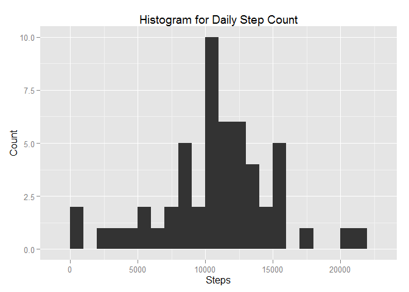
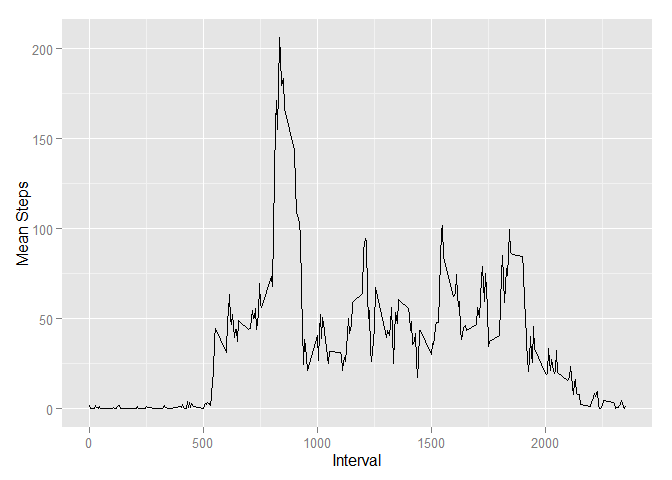
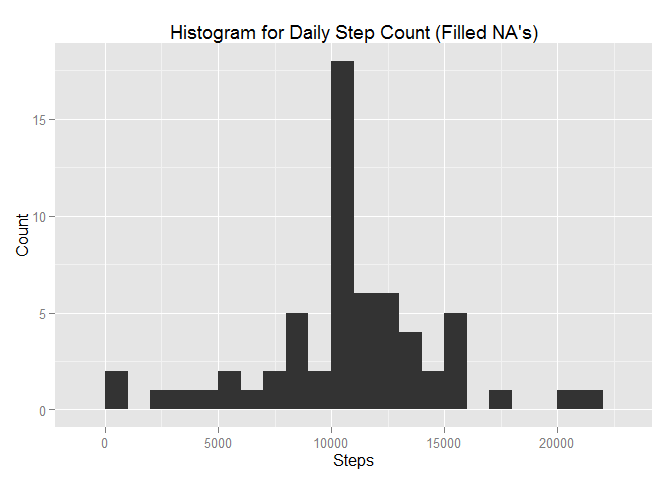
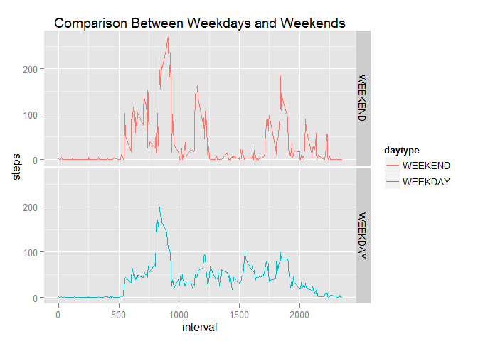
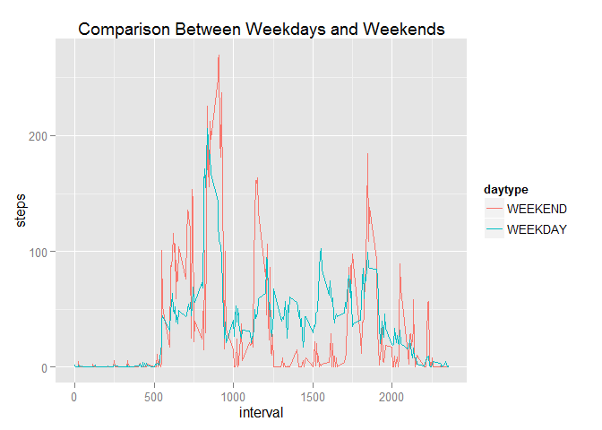

# Reproducible Research: Peer Assessment 1


  
## Loading and preprocessing the data

```r
  # Set the working directory

  library(dplyr,quietly=TRUE, warn.conflicts = FALSE, verbose=FALSE)
  library(ggplot2)
  library(lubridate)

  activity.file  <-   read.csv2("activity.csv",header=TRUE,sep=",") 
  
  
  activity <- activity.file[ ! is.na(activity.file$steps)    , ]
  
  
  daily <- summarise( group_by(activity, date), steps=sum(steps))
  by.interval <- summarise( group_by(activity,interval), mean.steps=mean(steps))
```

## What is mean total number of steps taken per day?

#### 1) Make a histogram of the total number of steps taken each day

```r
  qplot(daily$steps, geom="histogram", binwidth=1000, main="Histogram for Daily Step Count", xlab="Steps", ylab="Count")
```

\


#### 2) Calculate and report the mean and median total number of steps taken per day

#####a) Mean


```r
 mean(daily$steps)
```

```
## [1] 10766.19
```


#####b) Median


```r
 median(daily$steps)
```

```
## [1] 10765
```


## What is the average daily activity pattern?

#####1) Make a histogram of the total number of steps taken each day


```r
qplot( interval, mean.steps, data=by.interval, geom="line", xlab="Interval",ylab="Mean Steps") 
```

\


#####2) Which 5-minute interval, on average across all the days in the dataset, contains the maximum number of steps?


```r
     by.interval$interval[by.interval$mean.steps==max(by.interval$mean.steps)]
```

```
## [1] 835
```


## Imputing missing values

#####1) Calculate and report the total number of missing values in the dataset(i.e. the total number of rows with NAS)


```r
  sum( is.na(activity.file$steps)  )
```

```
## [1] 2304
```


#####2) Devise a strategy for filling in all of the missing values in the dataset. The strategy does not need to be sophisticated. For example, you could use the mean/median for that day, or the mean for that 5-minute interval, etc


##### The strategy will consist: fill with the average value of steps for all days.


```r
the.mean.to.fill <- mean(activity$steps)
```


#####3) Create a new dataset that is equal to the original dataset but with the missing data filled in


```r
activity.filled <- activity.file
activity.filled[is.na(activity.filled$steps),"steps"] <- the.mean.to.fill
```


#####4) Make a histogram of the total number of steps taken each day and calculate and report the mean and median total number of steps taken per day. Do these values differ from the estimates from the first part of the assignment? What is the impact of imputing missing data on the estimates of the total daily number of steps?


```r
 daily.filled <- summarise( group_by(activity.filled, date), steps=sum(steps)) 

  qplot(daily.filled$steps, geom="histogram", binwidth=1000, main="Histogram for Daily Step Count (Filled NA's)", xlab="Steps", ylab="Count") 
```

\


#####In shape there is no difference between this histogram and the previous one. 

#####The impact of filling missing data is: INCREASES the count of values for each element.


## Are there differences in activity patterns between weekdays and weekends?

#####1 Create a new factor variable in the dataset with two levels "weekday" and "weekend" indicating whether a given date is a weekday or weekend day


```r
  we <- mutate( subset( activity,  as.POSIXlt(date)$wday ==1 | as.POSIXlt(date)$wday==7),daytype=as.factor("WEEKEND"))
  
  wd <- mutate( subset( activity,  as.POSIXlt(date)$wday >=2 | as.POSIXlt(date)$wday<=6), daytype=as.factor("WEEKDAY"))
  
  alldays <- summarise( group_by(rbind(we,wd),daytype, interval ), steps=mean(steps)) 
```


#####2 Make a panel plot containing a time series plot of the 5-minute interval(x-axis) and the average number of steps taken, averaged acrosss all weekday days or weekend days (y axis).


```r
  qplot(interval, steps,  data=alldays,  geom="line", facets =daytype~., color=daytype,main="Comparison Between Weekdays and Weekends")
```

\


###### The same comparison


```r
  qplot(interval, steps,  data=alldays,  geom="line", color =daytype, main="Comparison Between Weekdays and Weekends")
```

\


